Manuscript Markdown
================
Madison Sandquist
2026-04-16

### Libraries Needed

``` r
library(tidyverse)
library(ggplot2)
library(car)
library(broom)
library(lme4)
library(lmerTest)
library(DHARMa)
library(emmeans) #pairwise comparisons
library(influence.ME) #outliers
library("wesanderson")
#remotes::install_github("r4ss/r4ss")
library(r4ss)
library(zoo)
library(patchwork)
library(stringr)
library(pls)
library(plsVarSel)
library(gridExtra)
library(grid)
library(slider)
library(glue)
```

### Increasing font size and color for graphing

``` r
# Set theme with larger axis titles and numbers
larger_axis_theme <-
  theme(
    panel.grid.major = element_blank(),
    panel.grid.minor = element_blank(),
    axis.line = element_line(color = "black"),
    legend.position = "none",
    axis.title = element_text(size = 16),   # Axis titles
    axis.text = element_text(size = 14),
    title = element_text(size = 20)# Axis numbers
  )

colors <- wes_palette("AsteroidCity1", type = "discrete")

spatial_colors <- c("mid" = colors[1], 
                      "north" = colors[4],
                 "south" = colors[3], 
                 "all" = colors[2])
```

## Stock Assessment Recruitment Deviations (Figure 1)

``` r
#recommended work flow, define model directory
# stock assessment file from PFMC website from the pfmc website 
model_path <- "D:/GPHR_BYEL_POST_STAR_BASE_MODEL" # this is the stock assessment file saved on an external hard drive
goph2019 <- r4ss::SS_output(model_path, printstats = FALSE)
```

    ## This function tested on SS versions 3.24 and 3.30.
    ##   You are using 3.30.13.09-opt which SHOULD work with this package.

    ## Report file time:Tue Dec 10 15:40:01 2024

    ## Reading full report file

    ## Got all columns using ncols = 53

    ## Got Report file

    ## Setting minimum biomass threshhold to 0.25  based on US west coast assumption associated with biomass target of 0.4.  (can replace or override in SS_plots by setting 'minbthresh')

    ## Got log file. There were NO temporary files were written in this run.

    ## Got warning file. Final line:Number_of_active_parameters_on_or_near_bounds: 0

    ## Finished reading files

    ## Removing 0 out of 16028 rows in CompReport.sso which are duplicates.

    ## CompReport file separated by this code as follows (rows = Ncomps*Nbins):
    ##   5032 rows of length comp data
    ##   10498 rows of conditional age-at-length data

    ## Finished dimensioning

    ## Got covar file.

    ## Finished primary run statistics list

    ## running SS_readstarter

    ##   data, control files: gopher.dat, gopher.ctl

    ##   converge_criterion = 1e-04

    ##   SPR_basis = 1

    ##   F_std_basis = 0

    ## Assuming version 3.30 based on number of numeric values.

    ##   MCMC_output_detail = 0

    ##   ALK_tolerance = 0

    ## Read of starter file complete. Final value: 3.3

    ## completed SS_output

``` r
with.covar = T   
parameters <- goph2019$parameters
goph_recruit <- goph2019$recruit

#not filtered for graphing 
goph_recruit_nf <-goph_recruit %>% 
  filter(Yr >= 1987, Yr <= 2018) %>% 
  rename(Year = Yr)

#filter for years to match the ROMS outputs
goph_recruit <-goph_recruit %>% 
  filter(Yr >= 1995, Yr <= 2018) %>% 
  rename(Year = Yr) 

# the pisco data from the SA file
PISCO_age0_index <- read_csv("Data/PISCO_age0_index.csv")
```

    ## Rows: 18 Columns: 3

    ## ── Column specification ────────────────────────────────────────────────────────
    ## Delimiter: ","
    ## dbl (3): Year, obs, stderr
    ## 
    ## ℹ Use `spec()` to retrieve the full column specification for this data.
    ## ℹ Specify the column types or set `show_col_types = FALSE` to quiet this message.

#### Figure 1 - Recruitment Deviation Time series

``` r
# ========== Time series of recruitment devs from SA ==========
stock_assessment <- ggplot(goph_recruit_nf, aes(x = Year, y = dev)) +
  geom_line(color = "steelblue", size = 1.2) +
  geom_hline(yintercept = 0, linetype = "dashed", color = "black", size = 1)+
  geom_vline(xintercept = 1995, linetype = "solid", color = "indianred")+
  theme_classic() +
  labs(title = "", y = "Recruitment Deviation", x = "Year") + 
  larger_axis_theme
# ========== Time series of PISCO index of abundance ==========
pisco_index <- ggplot(PISCO_age0_index, aes(x = Year, y = obs)) +
  geom_line(color = "navyblue", size = 1.2) +
  theme_classic() +
  labs(title = "", y = "Index of Abundance", x = "Year") + 
  scale_x_continuous(limits = c(1987, max(PISCO_age0_index$Year))) +
  larger_axis_theme
# ============= Corrleation plot ===========================

recruit_merged <- left_join(PISCO_age0_index, goph_recruit, by = "Year")
summary(recruit_merged)
```

    ##       Year           obs               stderr          SpawnBio    
    ##  Min.   :2001   Min.   :0.003946   Min.   :0.3272   Min.   :552.9  
    ##  1st Qu.:2005   1st Qu.:0.015264   1st Qu.:0.4171   1st Qu.:704.8  
    ##  Median :2010   Median :0.042925   Median :0.5732   Median :901.5  
    ##  Mean   :2010   Mean   :0.091528   Mean   :0.7679   Mean   :829.9  
    ##  3rd Qu.:2014   3rd Qu.:0.161917   3rd Qu.:1.0005   3rd Qu.:965.6  
    ##  Max.   :2018   Max.   :0.313990   Max.   :2.0004   Max.   :990.1  
    ##     exp_recr     with_regime   bias_adjusted    pred_recr         dev         
    ##  Min.   :2779   Min.   :2779   Min.   :2750   Min.   :1432   Min.   :-0.6535  
    ##  1st Qu.:2902   1st Qu.:2902   1st Qu.:2788   1st Qu.:1823   1st Qu.:-0.4457  
    ##  Median :3008   Median :3008   Median :2890   Median :2232   Median :-0.2549  
    ##  Mean   :2961   Mean   :2961   Mean   :2855   Mean   :2617   Mean   :-0.1658  
    ##  3rd Qu.:3034   3rd Qu.:3034   3rd Qu.:2915   3rd Qu.:3240   3rd Qu.: 0.1016  
    ##  Max.   :3044   Max.   :3044   Max.   :2924   Max.   :5264   Max.   : 0.6441  
    ##   biasadjuster         era              mature_bio      mature_num  
    ##  Min.   :0.07323   Length:18          Min.   :552.9   Min.   :1813  
    ##  1st Qu.:0.32000   Class :character   1st Qu.:704.8   1st Qu.:2190  
    ##  Median :0.32000   Mode  :character   Median :901.5   Median :2804  
    ##  Mean   :0.28957                      Mean   :829.9   Mean   :2658  
    ##  3rd Qu.:0.32000                      3rd Qu.:965.6   3rd Qu.:3084  
    ##  Max.   :0.32000                      Max.   :990.1   Max.   :3407  
    ##     raw_dev       
    ##  Min.   :-0.6535  
    ##  1st Qu.:-0.4457  
    ##  Median :-0.2549  
    ##  Mean   :-0.1658  
    ##  3rd Qu.: 0.1016  
    ##  Max.   : 0.6441

``` r
# Fit a linear model 
lm_recruit <- lm(dev ~ obs, data = recruit_merged)
summary(lm_recruit)
```

    ## 
    ## Call:
    ## lm(formula = dev ~ obs, data = recruit_merged)
    ## 
    ## Residuals:
    ##      Min       1Q   Median       3Q      Max 
    ## -0.24993 -0.04867 -0.01081  0.04762  0.37905 
    ## 
    ## Coefficients:
    ##             Estimate Std. Error t value Pr(>|t|)    
    ## (Intercept) -0.51998    0.04777  -10.88 8.33e-09 ***
    ## obs          3.86931    0.36270   10.67 1.11e-08 ***
    ## ---
    ## Signif. codes:  0 '***' 0.001 '**' 0.01 '*' 0.05 '.' 0.1 ' ' 1
    ## 
    ## Residual standard error: 0.1457 on 16 degrees of freedom
    ## Multiple R-squared:  0.8767, Adjusted R-squared:  0.869 
    ## F-statistic: 113.8 on 1 and 16 DF,  p-value: 1.109e-08

``` r
recruit_plot <- ggplot(recruit_merged, aes(x = obs, y = dev)) +
  geom_point(size = 3, shape = 21, fill = "grey30") +
  geom_smooth(method = "lm", se = TRUE, size = 1.2, color = "black") +
  annotate("text", x = Inf, y = Inf, label = paste0("p < 0.001 r² = 0.87"),
           hjust = 1, vjust = 1, size = 5, fontface = "italic") +
  labs(
    x = "Index of Abundance (PISCO)",
    y = "Recruitment Deviations (Stock Assessment)",
    title = ""
  ) +
  larger_axis_theme +
  theme(axis.title.y = element_blank(), 
        theme(axis.text = element_text(size = 16)))+
  theme_classic()
recruit_plot
```

    ## `geom_smooth()` using formula = 'y ~ x'

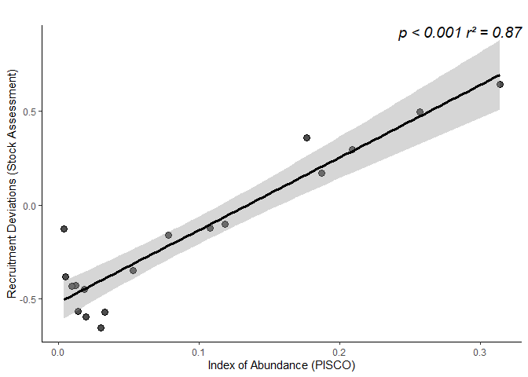<!-- -->

``` r
cor_plot <- ggsave("Figures/corr_rec.png", recruit_plot, width = 4, height = 4, dpi = 300)
```

    ## `geom_smooth()` using formula = 'y ~ x'

``` r
# ========== Combined Plot ==========
# Then combine them
fig1 <- stock_assessment / pisco_index + plot_layout(ncol = 1)
fig1
```

<!-- -->

``` r
ggsave("Figures/fig1.png", fig1, width = 7, height = 5, dpi = 300)
```

## Cleaning and Combining Oceanographic Parameters

#### Ocean model inputs from ROMS

This data has been clean in python previous (see Python file for
cleaning code)

``` r
# load in data frame that is just DO, pH, temperature, CHLa,
df_ocean <- read_csv("Data/monthly_averages_allyear_1995_2020_ALL_41to34p4.csv")
```

    ## Rows: 312 Columns: 10
    ## ── Column specification ────────────────────────────────────────────────────────
    ## Delimiter: ","
    ## chr (1): Month
    ## dbl (9): Year, DO_avg, DO_sd, pH_avg, pH_sd, Temperature_avg, Temperature_sd...
    ## 
    ## ℹ Use `spec()` to retrieve the full column specification for this data.
    ## ℹ Specify the column types or set `show_col_types = FALSE` to quiet this message.

``` r
df_ocean <- df_ocean %>% 
  select(-Chla_avg, -Chla_sd)

# load in data frame that is wind
df_wind <- read.csv("Data/monthly_upwelling_wind_offshore_averages_ALL_41to34p4.csv")

# change coding of month to merge
df_wind1 <- df_wind %>%
  mutate(Month = case_when(
    Month == "January"   ~ "Jan",
    Month == "February"  ~ "Feb",
    Month == "March"     ~ "Mar",
    Month == "April"     ~ "Apr",
    Month == "May"       ~ "May",
    Month == "June"      ~ "Jun",
    Month == "July"      ~ "Jul",
    Month == "August"    ~ "Aug",
    Month == "September" ~ "Sep",
    Month == "October"   ~ "Oct",
    Month == "November"  ~ "Nov",
    Month == "December"  ~ "Dec",
    TRUE ~ Month  # keep original if no match
  ))

# Combine into one data frame 
ROMS_outputs <- left_join(df_ocean, df_wind1, by = c("Year", "Month"))
```

#### Coastal Upwelling Transport Index

``` r
cuti <- read.csv("Data/CUTI_daily.csv") %>%
  select(year, month, day,
         X35N, X36N, X37N, X38N, X39N, X40N, X41N) %>%
  filter(year < 2020)%>% 
  filter(year > 1994)

# 1) Monthly mean for each latitude (averaging over days)
monthly_lat <- cuti %>%
  group_by(year, month) %>%
  summarise(across(starts_with("X"), ~ mean(.x, na.rm = TRUE)), .groups = "drop") %>%
  pivot_longer(cols = starts_with("X"), names_to = "lat_col", values_to = "CUTI") %>%
  mutate(lat = as.integer(str_extract(lat_col, "\\d+"))) %>%
  filter(between(lat, 35, 41))

# 2) One monthly mean across ALL latitudes 34–41 (equal weight per latitude)
cuti_tidy <- monthly_lat %>%
  group_by(year, month) %>%
  summarise(CUTI = mean(CUTI, na.rm = TRUE), .groups = "drop") %>%
  rename(Year = year, Month = month) %>%
  mutate(
    Month = month.abb[as.integer(Month)]
  ) %>%
  arrange(Year, match(Month, month.abb))
```

#### Sea Level

``` r
sl <- read.csv("Data/SLH_FULL.csv") %>% 
  filter(SL > 0)
  
monthly_avg_sl <- sl %>%
  group_by(Year, Month) %>%
  summarize(mean_sl = mean(SL, na.rm = TRUE), .groups = "drop") %>% 
  filter(Year >= 1995 & Year <= 2020)
```

#### PDO

``` r
pdo <- read.csv("Data/pdo.timeseries.sstens.csv")

# Convert the Date column to Date type
pdo$Date <- as.Date(pdo$Date)

# Filter the dataframe between 1995 and 2018
monthly_avg_pdo <- pdo %>%
  filter(Date >= as.Date("1995-01-01") & Date <= as.Date("2020-12-01")) %>% 
  rename(mean_pdo = PDO.from.Ensemble.SST.https...psl.noaa.gov..pdo..Using.EOF.from.1920.to.2014.for.N.Pacific..see.webpage.) %>% 
    mutate(
    Year = year(Date),
    Month = month(Date)
  )
```

#### NPGO

``` r
npgo <- read.csv("Data/npgo.csv")

monthly_avg_npgo <- npgo %>%
  mutate(Date = mdy(Date),
         Year = year(Date),
         Month = month(Date)) %>%
  filter(Year >= 1995 & Year <= 2020) %>%
  group_by(Year, Month) %>%
  summarise(npgo_avg = mean(NPGO, na.rm = TRUE), .groups = "drop")
```

#### ONI

``` r
ONI <- read.csv("Data/ONI_data.csv")
monthly_avg_ONI <- ONI %>%
  pivot_longer(
    cols = all_of(month.abb),  # Ensures only "Jan" to "Dec"
    names_to = "Month_name",
    values_to = "oni_avg"
  ) %>%
  mutate(
    Month = match(Month_name, month.abb)
  ) %>%
  select(Year, Month, oni_avg) %>%
  arrange(Year, Month) %>% 
  filter(Year > 1994) %>% 
  filter(Year < 2020)
```

#### Combine indices into single data frame

``` r
# non spatially separated 
combined_monthly_indices <- monthly_avg_sl %>%
  full_join(monthly_avg_pdo, by = c("Year", "Month")) %>%
  full_join(monthly_avg_npgo, by = c("Year", "Month")) %>%
  full_join(monthly_avg_ONI, by = c("Year", "Month")) %>% 
  arrange(Year, Month) %>%
  filter(Year < 2019) %>%
  mutate(Month = month.abb[Month])
head(combined_monthly_indices)
```

    ## # A tibble: 6 × 7
    ##    Year Month mean_sl Date       mean_pdo npgo_avg oni_avg
    ##   <dbl> <chr>   <dbl> <date>        <dbl>    <dbl>   <dbl>
    ## 1  1995 Jan     2958. 1995-01-01   -0.768   -0.499    0.96
    ## 2  1995 Feb     2851. 1995-02-01    0.049   -1.56     0.72
    ## 3  1995 Mar     2923. 1995-03-01    0.571   -2.06     0.53
    ## 4  1995 Apr     2730. 1995-04-01    0.67    -1.82     0.3 
    ## 5  1995 May     2750. 1995-05-01    1.14    -1.50     0.14
    ## 6  1995 Jun     2746. 1995-06-01    1.11    -1.05    -0.03

``` r
# Combined with ROMS with cuti 
ROMS_CUTI_environmental_combined_all_yr <- ROMS_outputs %>%
  full_join(cuti_tidy, by = c("Year", "Month"))

head(ROMS_CUTI_environmental_combined_all_yr)
```

    ## # A tibble: 6 × 11
    ##    Year Month DO_avg DO_sd pH_avg  pH_sd Temperature_avg Temperature_sd
    ##   <dbl> <chr>  <dbl> <dbl>  <dbl>  <dbl>           <dbl>          <dbl>
    ## 1  1995 Jan     8.58 0.357   8.04 0.0237           12.0           0.490
    ## 2  1995 Feb     7.82 0.666   8.01 0.0382           11.8           0.747
    ## 3  1995 Mar     7.94 0.567   8.02 0.0357           12.0           0.809
    ## 4  1995 Apr     5.81 0.902   7.88 0.0478            9.64          0.908
    ## 5  1995 May     5.41 0.788   7.84 0.0377            9.24          0.902
    ## 6  1995 Jun     5.00 0.762   7.80 0.0311            9.51          1.05 
    ## # ℹ 3 more variables: UpwellWind_avg <dbl>, UpwellWind_sd <dbl>, CUTI <dbl>

``` r
df_all_parameters <- ROMS_CUTI_environmental_combined_all_yr %>% 
  full_join(combined_monthly_indices, by = c("Year", "Month"))%>% 
  select(-Date)

head(df_all_parameters)
```

    ## # A tibble: 6 × 15
    ##    Year Month DO_avg DO_sd pH_avg  pH_sd Temperature_avg Temperature_sd
    ##   <dbl> <chr>  <dbl> <dbl>  <dbl>  <dbl>           <dbl>          <dbl>
    ## 1  1995 Jan     8.58 0.357   8.04 0.0237           12.0           0.490
    ## 2  1995 Feb     7.82 0.666   8.01 0.0382           11.8           0.747
    ## 3  1995 Mar     7.94 0.567   8.02 0.0357           12.0           0.809
    ## 4  1995 Apr     5.81 0.902   7.88 0.0478            9.64          0.908
    ## 5  1995 May     5.41 0.788   7.84 0.0377            9.24          0.902
    ## 6  1995 Jun     5.00 0.762   7.80 0.0311            9.51          1.05 
    ## # ℹ 7 more variables: UpwellWind_avg <dbl>, UpwellWind_sd <dbl>, CUTI <dbl>,
    ## #   mean_sl <dbl>, mean_pdo <dbl>, npgo_avg <dbl>, oni_avg <dbl>

### Oceanographic Time Series (Figures 2 and 3)

#### Figure 2. Nearshore Habitat From 1995 to 2018

``` r
ROMS_CUTI_environmental_combined_all_yr_plot <- ROMS_CUTI_environmental_combined_all_yr %>%
  filter(Year <= 2018) %>% 
  mutate(
    Month_num = match(Month, month.abb),
    Date = as.Date(paste(Year, Month_num, 1, sep = "-"))
  )

plot_df <- ROMS_CUTI_environmental_combined_all_yr_plot %>%
  select(Date,
         DO_avg,
         pH_avg,
         Temperature_avg,
         UpwellWind_avg, 
         CUTI) %>%
  pivot_longer(
    cols = -Date,
    names_to = "variable",
    values_to = "value"
  ) %>%
  mutate(
    panel = dplyr::recode(variable,
      DO_avg = "Dissolved Oxygen",
      pH_avg = "pH",
      Temperature_avg = "Temperature",
      UpwellWind_avg = "Vwind", 
      CUTI = "Upwelling"
    ),
    panel = factor(panel,
      levels = c("Dissolved Oxygen", "pH", "Temperature", "Vwind", "Upwelling")
    )
  )

shade_df <- plot_df %>%
  distinct(year = lubridate::year(Date)) %>%
  mutate(
    xmin = as.Date(paste0(year, "-01-01")),
    xmax = as.Date(paste0(year, "-08-31"))
  )


fig2 <- ggplot(plot_df, aes(x = Date, y = value)) +
  geom_rect(
    data = shade_df,
    aes(xmin = xmin, xmax = xmax, ymin = -Inf, ymax = Inf),
    inherit.aes = FALSE,
    fill = "lightblue",
    alpha = 0.4
  ) +
  geom_line(color = "black", linewidth = 0.7) +
  facet_wrap(~panel, ncol = 1, scales = "free_y", strip.position = "top") +
  scale_x_date(
    date_breaks = "3 years",
    date_labels = "%Y",
    expand = expansion(mult = c(0.01, 0.01))
  ) +
  labs(x = NULL, y = NULL) +
  theme_bw(base_size = 14) +
  theme(
    strip.text = element_text(size = 16),
    axis.text = element_text(size = 11),
    axis.text.x = element_text(angle = 45, hjust = 1),
    legend.position = "none"
  )
fig2
```

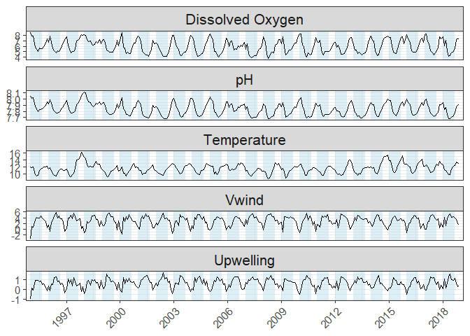<!-- -->

``` r
ggsave("Figures/fig2.png", fig2, width = 7, height = 8, dpi = 300)
```

#### Figure 3 Ocean Basin Indices Time Series

``` r
# make long data
plot_df <- combined_monthly_indices %>%
  select(Date, mean_sl, mean_pdo, npgo_avg, oni_avg) %>%
  pivot_longer(
    cols = c(npgo_avg, oni_avg, mean_pdo, mean_sl),
    names_to = "variable",
    values_to = "value"
  ) %>%
  mutate(
    panel = dplyr::recode(
      variable,
      npgo_avg = "NPGO",
      oni_avg  = "ONI",
      mean_pdo = "PDO",
      mean_sl  = "Sea Level Height"
    ),
    panel = factor(panel, levels = c("NPGO", "ONI", "PDO", "Sea Level Height")),
    sign = case_when(
      panel != "Sea Level Height" & value >= 0 ~ "pos",
      panel != "Sea Level Height" & value <  0 ~ "neg",
      TRUE ~ "line"
    )
  )

shade_df <- plot_df %>%
  distinct(year = lubridate::year(Date)) %>%
  mutate(
    xmin = as.Date(paste0(year, "-01-01")),
    xmax = as.Date(paste0(year, "-08-31"))
  )

fig_sup1 <- ggplot() +
  geom_rect(
    data = shade_df,
    aes(xmin = xmin, xmax = xmax, ymin = -Inf, ymax = Inf),
    inherit.aes = FALSE,
    fill = "lightblue",
    alpha = 0.5
  ) +
  # bar panels
  geom_col(
    data = filter(plot_df, panel != "Sea Level Height"),
    aes(Date, value, fill = sign),
    width = 25
  ) +
  # sea level line
  geom_line(
    data = filter(plot_df, panel == "Sea Level Height"),
    aes(Date, value),
    color = "black",
    linewidth = 0.7
  ) +
  facet_wrap(~panel, ncol = 1, scales = "free_y", strip.position = "top") +
  scale_fill_manual(
    values = c(pos = "indianred2", neg = "navy"),
    guide = "none"
  ) +
  scale_x_date(
    date_breaks = "3 years",
    date_labels = "%Y",
    expand = expansion(mult = c(0.01, 0.01))
  ) +
  labs(x = NULL, y = NULL) +
  theme_bw(base_size = 14) +
  theme(
    panel.grid.major = element_line(color = "grey85", linewidth = 0.5),
    panel.grid.minor = element_line(color = "grey92", linewidth = 0.3),
    strip.background = element_rect(fill = "grey80", color = "grey40"),
    strip.text = element_text(face = "bold", size = 18),
    axis.text.x = element_text(angle = 45, hjust = 1),
    panel.spacing = unit(0.15, "lines"),
    legend.position = "none"
  )

fig_sup1
```

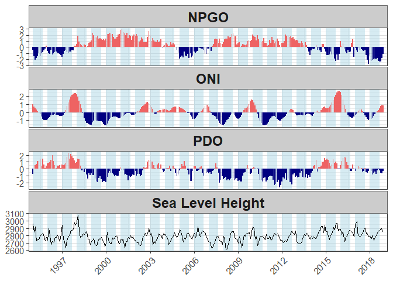<!-- -->

``` r
ggsave("Figures/figsup1.png", fig_sup1, width = 7, height = 7, dpi = 300)
```

## Monthly Correlation Analysis

``` r
# Join with environmental data
full_data <- left_join(df_all_parameters, goph_recruit, by = "Year")

# List of variables you want to correlate with recruitment
vars_to_correlate <- c("mean_sl", "mean_pdo", "npgo_avg", "oni_avg", "DO_avg", "pH_avg", "Temperature_avg", "CUTI", "UpwellWind_avg")

# Calculate correlations by month
cor_data <- full_data %>%
  pivot_longer(cols = all_of(vars_to_correlate), names_to = "Variable", values_to = "Value") %>%
  group_by(Variable, Month) %>%
  summarise(
    cor_test = list(cor.test(Value, dev, method = "pearson")),
    .groups = "drop"
  ) %>%
  mutate(
    correlation = map_dbl(cor_test, ~ .x$estimate),
    pval        = map_dbl(cor_test, ~ .x$p.value),
    t_stat      = map_dbl(cor_test, ~ .x$statistic),
    significant = pval < 0.05
  ) %>%
  select(-cor_test)


# Order months properly
cor_data$Month <- factor(cor_data$Month, levels = c("Jan", "Feb", "Mar", "Apr", "May", "Jun", "Jul", "Aug", "Sep", "Oct", "Nov", "Dec"))

cor_data <- cor_data %>%
  mutate(Variable = dplyr::recode(as.character(Variable),
    "mean_pdo"        = "PDO",
    "mean_sl"         = "Sea Level",
    "npgo_avg"        = "NPGO",
    "oni_avg"         = "ONI",
    "DO_avg" = "DO",
    "pH_avg"  = "pH",
    "Temperature_avg" = "Temperature",
    "UpwellWind_avg" = "Wind", 
    "CUTI" = "Upwelling"
  ))
```

#### Figure 4 - Correlation plot

``` r
desired_order <- c("DO","pH","Temperature", "Wind", "Upwelling", "PDO","Sea Level", "NPGO", "ONI")

cor_data$Variable <- factor(cor_data$Variable, levels = desired_order)

fig4 <- ggplot(cor_data, aes(x = Month, y = correlation, color = significant, group = 1)) +
  geom_point(size = 3) +
 geom_line(size = 1) +
  facet_wrap(~Variable, ncol = 2) +
  geom_hline(yintercept = 0, linetype = "solid", size = 0.25) +
  geom_hline(yintercept = c(-0.25, 0.25), linetype = "dashed", color = "black", size = 0.75) +
  scale_color_manual(values = c("FALSE" = "black", "TRUE" = "indianred")) +
  theme_classic() +
  labs(
    title = "",
    y = "Correlation with Recruitment",
    color = "Significant"
  )+   theme_bw() +
  theme(strip.text = element_text(size = 12, face = "bold"), 
        axis.line = element_line(color = "black"),
        legend.position = "none",
        axis.title = element_text(size = 16),   # Axis titles
        axis.text = element_text(size = 14),
        axis.text.x = element_text(angle = 45, hjust = 1),  # 
        title = element_text(size = 20))
fig4
```

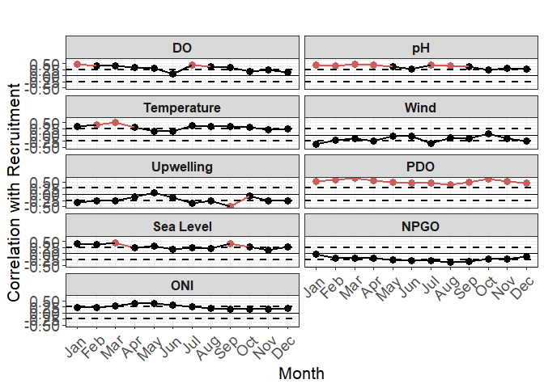<!-- -->

``` r
# Making a data frame with significant months 
significant_months <- cor_data %>%
  filter(significant == TRUE)

ggsave("Figures/fig4.png", fig4, width = 12, height = 12, dpi = 300)
```

## PSLR Analysis

### PSLR averaging from Jan to Aug

``` r
# Average oceanographic parameters annually 
df_all_parameters_feb_sept_average <- df_all_parameters %>% 
  filter(Month %in% c("Jan", "Feb", "Mar", "Apr", "May", "Jun", "Jul", "Aug")) %>% 
  group_by(Year) %>%
  summarise(across(
    c(DO_avg, pH_avg, Temperature_avg, UpwellWind_avg,CUTI, mean_pdo, npgo_avg, mean_sl, oni_avg),
    ~ mean(.x, na.rm = TRUE),
    .names = "mean_{.col}"
  )) %>%
  ungroup()

# combined 
df_gopher_avg_mar_sept <-left_join(df_all_parameters_feb_sept_average,goph_recruit, by = "Year")

df_gopher_avg_mar_sept <- df_gopher_avg_mar_sept %>% 
  select(dev, mean_mean_pdo, mean_CUTI, mean_mean_sl,mean_pH_avg, mean_DO_avg, mean_Temperature_avg) %>% 
  rename(deviation = dev, 
         CUTI = mean_CUTI,
         PDO = mean_mean_pdo,
         "Sea level height" = mean_mean_sl, 
         pH = mean_pH_avg, 
         DO = mean_DO_avg, 
         Temperature = mean_Temperature_avg)

# Define X and Y together and filter complete cases
X_raw <- df_gopher_avg_mar_sept %>% 
  select(PDO, CUTI,  "Sea level height" ,pH, DO, Temperature)

# Combine into one frame with response
data_complete <- cbind(dev = df_gopher_avg_mar_sept$deviation, X_raw) %>% 
  as.data.frame() %>% 
  na.omit()  # remove rows with any NA

# Now separate into X and Y
Y <- data_complete$dev
X <- as.matrix(data_complete %>% select(-dev))

plsr_model <- plsr(Y ~ X, scale = TRUE, validation = "LOO")
pls_scores <- scores(plsr_model)

df_pls <- data.frame(
  dev = Y,
  Comp1 = pls_scores[, 1],
  Comp2 = pls_scores[, 2]
)

# Summary of model
summary(plsr_model)
```

    ## Data:    X dimension: 24 6 
    ##  Y dimension: 24 1
    ## Fit method: kernelpls
    ## Number of components considered: 6
    ## 
    ## VALIDATION: RMSEP
    ## Cross-validated using 24 leave-one-out segments.
    ##        (Intercept)  1 comps  2 comps  3 comps  4 comps  5 comps  6 comps
    ## CV          0.3984   0.3588   0.3820   0.4322   0.4367   0.4243   0.3982
    ## adjCV       0.3984   0.3579   0.3802   0.4291   0.4328   0.4203   0.3951
    ## 
    ## TRAINING: % variance explained
    ##    1 comps  2 comps  3 comps  4 comps  5 comps  6 comps
    ## X    74.37    84.61    90.20    94.71    98.39   100.00
    ## Y    34.04    42.15    46.56    51.55    53.54    53.75

``` r
# Root Mean Squared Error of Prediction
RMSEP(plsr_model)
```

    ##        (Intercept)  1 comps  2 comps  3 comps  4 comps  5 comps  6 comps
    ## CV          0.3984   0.3588   0.3820   0.4322   0.4367   0.4243   0.3982
    ## adjCV       0.3984   0.3579   0.3802   0.4291   0.4328   0.4203   0.3951

``` r
# Choose number of components based on RMSEP or % variance explained
plot(RMSEP(plsr_model), legendpos = "topright")
```

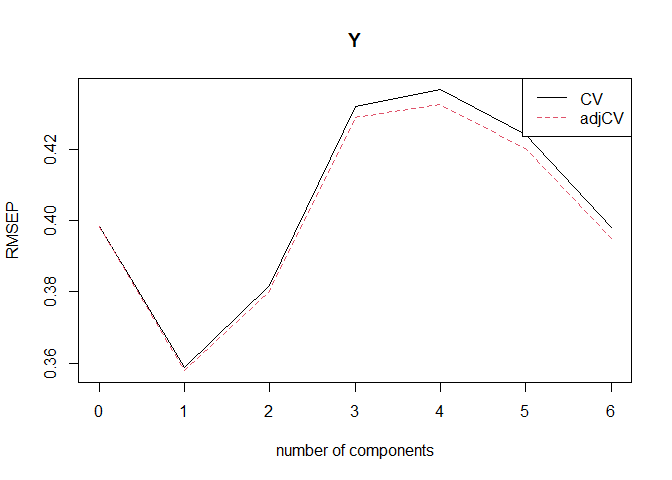<!-- -->

``` r
# Variance explained
explvar(plsr_model)  # % of variance explained in X by each component
```

    ##    Comp 1    Comp 2    Comp 3    Comp 4    Comp 5    Comp 6 
    ## 74.373632 10.241253  5.580818  4.518561  3.677128  1.608607

``` r
# Component loadings: how original vars contribute to latent variables
loadings(plsr_model)
```

    ## 
    ## Loadings:
    ##                  Comp 1 Comp 2 Comp 3 Comp 4 Comp 5 Comp 6
    ## PDO               0.348  0.888 -0.484  0.265              
    ## CUTI             -0.405        -0.273  0.886 -0.793 -0.148
    ## Sea level height  0.430 -0.359 -0.640  0.318  0.173 -0.731
    ## pH                0.441 -0.135  0.716 -0.330 -0.545       
    ## DO                0.443 -0.335  0.851                     
    ## Temperature       0.412 -0.272 -0.872  0.618 -0.289  0.658
    ## 
    ##                Comp 1 Comp 2 Comp 3 Comp 4 Comp 5 Comp 6
    ## SS loadings     1.030  1.123  2.715  1.449  1.048  1.000
    ## Proportion Var  0.172  0.187  0.452  0.242  0.175  0.167
    ## Cumulative Var  0.172  0.359  0.811  1.053  1.227  1.394

``` r
# Scores: the new coordinate representation of observations
pls_scores <- scores(plsr_model)

# Biplot: visualize scores and loadings
biplot(plsr_model, comps = 1:2)
```

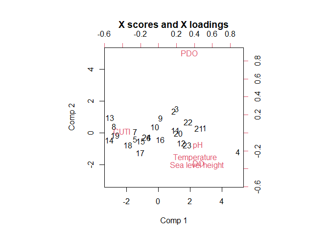<!-- -->

``` r
# Fit a linear model using first 2 PLS components
lm_pls <- lm(dev ~ Comp1 + Comp2, data = df_pls)
summary(lm_pls)
```

    ## 
    ## Call:
    ## lm(formula = dev ~ Comp1 + Comp2, data = df_pls)
    ## 
    ## Residuals:
    ##      Min       1Q   Median       3Q      Max 
    ## -0.46681 -0.27437 -0.00765  0.24984  0.47001 
    ## 
    ## Coefficients:
    ##             Estimate Std. Error t value Pr(>|t|)   
    ## (Intercept) -0.10863    0.06337  -1.714  0.10124   
    ## Comp1        0.10933    0.03110   3.515  0.00206 **
    ## Comp2        0.15014    0.08750   1.716  0.10092   
    ## ---
    ## Signif. codes:  0 '***' 0.001 '**' 0.01 '*' 0.05 '.' 0.1 ' ' 1
    ## 
    ## Residual standard error: 0.3105 on 21 degrees of freedom
    ## Multiple R-squared:  0.4215, Adjusted R-squared:  0.3664 
    ## F-statistic:  7.65 on 2 and 21 DF,  p-value: 0.003194

``` r
# check residuals 
simulated_res <- simulateResiduals(fittedModel = lm_pls)
plot(simulated_res) #these look good
```

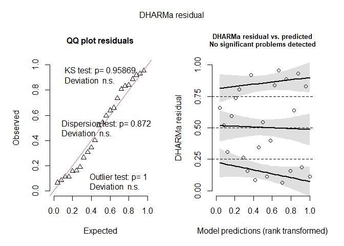<!-- -->

``` r
selectNcomp(plsr_model, method = "onesigma")
```

    ## [1] 0

``` r
lm_pls_1comp <- lm(dev ~ Comp1, data = df_pls)
summary(lm_pls_1comp)
```

    ## 
    ## Call:
    ## lm(formula = dev ~ Comp1, data = df_pls)
    ## 
    ## Residuals:
    ##      Min       1Q   Median       3Q      Max 
    ## -0.54706 -0.18144 -0.08878  0.29660  0.47372 
    ## 
    ## Coefficients:
    ##             Estimate Std. Error t value Pr(>|t|)   
    ## (Intercept) -0.10863    0.06611  -1.643  0.11459   
    ## Comp1        0.10933    0.03245   3.369  0.00277 **
    ## ---
    ## Signif. codes:  0 '***' 0.001 '**' 0.01 '*' 0.05 '.' 0.1 ' ' 1
    ## 
    ## Residual standard error: 0.3239 on 22 degrees of freedom
    ## Multiple R-squared:  0.3404, Adjusted R-squared:  0.3104 
    ## F-statistic: 11.35 on 1 and 22 DF,  p-value: 0.002766

``` r
plot(RMSEP(plsr_model), legendpos = "topright")
```

<!-- -->

``` r
# 1-component model is optimal, so we use opt.comp = 1
vip_scores <- VIP(plsr_model, opt.comp = 1)

# Turn into data frame properly
vip_df <- data.frame(
  Variable = names(vip_scores),
  VIP = vip_scores
)

ggplot(vip_df, aes(x = reorder(Variable, VIP), y = VIP)) +
  geom_col(fill = "steelblue") +
  geom_hline(yintercept = 1, linetype = "dashed", color = "indianred4", size = 1) +
  geom_hline(yintercept = .8, linetype = "dashed", color = "indianred3", size = 1) +
  coord_flip() +
  theme_classic() +
  labs(title = "Variable Importance in Projection (VIP)",
       x = "Predictor",
       y = "VIP Score")
```

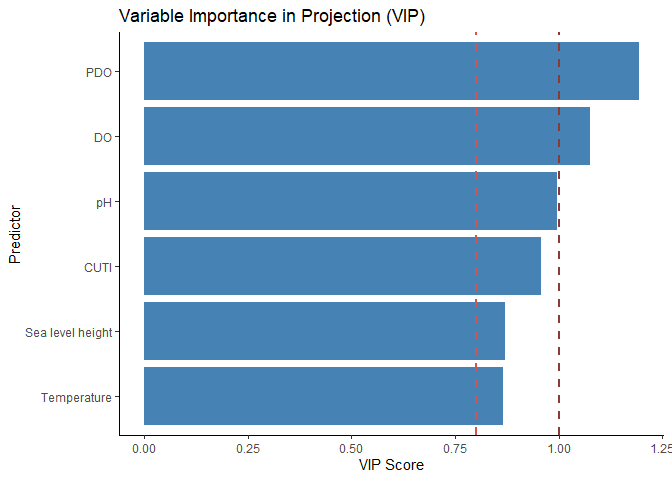<!-- -->

#### Combined figure for PSLR

``` r
# Extract predictor names from X
predictor_names <- colnames(X)

# ========== FIGURE A: PLS BIPLOT ==========

loadings_data <- loadings(plsr_model)[, 1:2]
loadings_df <- data.frame(
  Variable = rownames(loadings_data),
  Component1 = loadings_data[, 1],
  Component2 = loadings_data[, 2]
)

fig_a_repro <- ggplot(loadings_df, aes(x = Component1, y = Component2)) +
  # Unit circle
  geom_path(data = data.frame(
    x = cos(seq(0, 2 * pi, length.out = 100)),
    y = sin(seq(0, 2 * pi, length.out = 100))
  ), aes(x = x, y = y), color = "black", linewidth = 1) +

  # Arrows and labels
  geom_segment(aes(x = 0, y = 0, xend = Component1, yend = Component2),
               arrow = arrow(length = unit(0.3, "cm")), 
               color = "steelblue", linewidth = 1.2) +
  geom_text(aes(label = Variable), 
            color = "steelblue", size = 4, fontface = "bold",
            nudge_x = ifelse(loadings_df$Component1 > 0, 0.05, -0.05),
            nudge_y = ifelse(loadings_df$Component2 > 0, 0.05, -0.05)) +
  
  # Optional: Response direction (illustrative only)
  # You can calculate actual correlation direction if desired
  geom_segment(aes(x = 0, y = 0, xend = 0.6, yend = 0.4), 
               arrow = arrow(length = unit(0.5, "cm")), 
               color = "indianred", linewidth = 1.5) +
  geom_text(aes(x = 0.68, y = 0.45, label = "Recruitment"), 
             color = "indianred", size = 4, fontface = "bold") +
  
  xlim(-1.1, 1.1) + ylim(-1.1, 1.1) +
  labs(x = "Component 1", y = "Component 2", title = "Reproductive Season Average") +
  theme_minimal() +
  theme(
    panel.grid = element_blank(),
    axis.line = element_line(color = "black"),
    plot.title = element_text(size = 16, face = "bold"),
    axis.title = element_text(size = 12),
    axis.text = element_text(size = 10)
  ) +
  coord_fixed()
# ========== FIGURE B: COMPONENT 1 vs RESPONSE ==========

# Ensure response is matched to filtered data
component1_scores <- scores(plsr_model)[, 1]
response_var <- Y  # this Y comes from the filtered, complete-case data

# Compute R² and p-value
var_explained <- explvar(plsr_model)[1]
lm_comp1 <- lm(response_var ~ component1_scores)
lm_summary <- summary(lm_comp1)
p_value <- lm_summary$coefficients[2, 4]
r_squared <- lm_summary$r.squared

# Format p-value
p_text <- if (p_value < 0.001) {
  "p < 0.001"
} else if (p_value < 0.01) {
  paste0("p = ", format(round(p_value, 3), nsmall = 3))
} else {
  paste0("p = ", format(round(p_value, 2), nsmall = 2))
}

annotation_text <- paste0("R² = ", format(round(r_squared, 3), nsmall = 3), "\n", p_text)

fig_b_repro <- ggplot(data.frame(Component1 = component1_scores, Response = response_var),
                aes(x = Component1, y = Response)) +
  geom_point(size = 2.5, alpha = 0.7) +
  geom_smooth(method = "lm", color = "steelblue", fill = "black", alpha = 0.3) +
  annotate("text", 
           x = Inf, y = Inf, 
           label = annotation_text,
           hjust = 1.3, vjust = 1.3,
           size = 4, 
           fontface = "bold",
           color = "black") +
  labs(
    x = paste0("PLSR component 1 (", round(var_explained, 1), "%)"),
    y = "Recruitment Deviations",
    title = ""
  ) +
  theme_classic() +
  theme(
    panel.grid.minor = element_blank(),
    plot.title = element_text(size = 16, face = "bold"),
    axis.title = element_text(size = 12),
    axis.text = element_text(size = 10)
  )


# ========== FIGURE C: VIP PLOT ==========

fig_c_repro <- ggplot(vip_df, aes(x = reorder(Variable, VIP), y = VIP)) +
  geom_col(fill = "steelblue") +
  geom_hline(yintercept = 1, linetype = "dashed", color = "indianred4", size = 1) +
  geom_hline(yintercept = 0.8, linetype = "dashed", color = "indianred3", size = 1) +
  coord_flip() +
  theme_classic() +
  labs(title = "",
       x = "Predictor",
       y = "VIP Score") +
  theme(
    plot.title = element_text(size = 16, face = "bold"),
    axis.title = element_text(size = 12),
    axis.text = element_text(size = 10)
  )


# ========== COMBINE ALL THREE FIGURES ==========
combined_plot <- fig_a_repro + fig_b_repro + fig_c_repro + 
  plot_layout(ncol = 3)
combined_plot
```

    ## Warning in geom_segment(aes(x = 0, y = 0, xend = 0.6, yend = 0.4), arrow = arrow(length = unit(0.5, : All aesthetics have length 1, but the data has 6 rows.
    ## ℹ Please consider using `annotate()` or provide this layer with data containing
    ##   a single row.

    ## Warning in geom_text(aes(x = 0.68, y = 0.45, label = "Recruitment"), color = "indianred", : All aesthetics have length 1, but the data has 6 rows.
    ## ℹ Please consider using `annotate()` or provide this layer with data containing
    ##   a single row.

    ## `geom_smooth()` using formula = 'y ~ x'

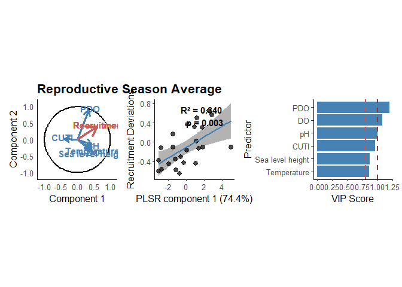<!-- -->

``` r
ggsave('Figures/fig5_repro.png', width = 10, height = 4, dpi = 300)
```

    ## Warning in geom_segment(aes(x = 0, y = 0, xend = 0.6, yend = 0.4), arrow = arrow(length = unit(0.5, : All aesthetics have length 1, but the data has 6 rows.
    ## ℹ Please consider using `annotate()` or provide this layer with data containing
    ##   a single row.
    ## All aesthetics have length 1, but the data has 6 rows.
    ## ℹ Please consider using `annotate()` or provide this layer with data containing
    ##   a single row.

    ## `geom_smooth()` using formula = 'y ~ x'

## Best historical predictor - including CUTI just for fun

``` r
## Join everything
df_env_joined <- left_join(ROMS_CUTI_environmental_combined_all_yr, goph_recruit, by = "Year") %>%
  select(Year, Month, DO_avg, pH_avg, Temperature_avg, dev, CUTI) %>% 
  rename('CUTI_avg' = "CUTI")

## Puts drivers into long format and calculates rolling averages 
### Calculates trailing rolling averages - so the rolling average ends in the month it states
### EX - 3-month in "Jul" is May, June, July
month_levels <- c("Jan", "Feb", "Mar", "Apr", "May", "Jun",
                  "Jul", "Aug", "Sep", "Oct", "Nov", "Dec")

df_long <- df_env_joined %>%
  pivot_longer(
    cols = c(DO_avg, pH_avg, Temperature_avg, CUTI_avg),
    names_to = "driver",
    values_to = "value"
  ) %>%
  mutate(
    Month = factor(Month, levels = month_levels, ordered = TRUE),
    Month_num = match(as.character(Month), month_levels)
  ) %>%
  arrange(driver, Year, Month_num)

df_windows <- df_long %>%
  group_by(driver, Year) %>%
  arrange(Month_num, .by_group = TRUE) %>%
  mutate(
    value_1mo = value,
    value_3mo = slide_dbl(value, mean, .before = 2, .complete = TRUE, na.rm = FALSE), 
    value_6mo = slide_dbl(value, mean, .before = 6, .complete = TRUE, na.rm = FALSE)
  ) %>%
  ungroup()


df_candidates <- df_windows %>%
  select(Year, Month, dev, driver, value_1mo, value_3mo, value_6mo) %>%
  pivot_longer(
    cols = starts_with("value_"),
    names_to = "window",
    values_to = "predictor"
  ) %>%
  mutate(
    window = dplyr::recode(
      window,
      value_1mo = "single month",
      value_3mo = "3-month rolling avg",
      value_6mo = "6-month rolling avg"
    )
  ) %>%
  filter(!is.na(predictor), !is.na(dev))

## Fit every model and choose best per driver
model_results <- df_candidates %>%
  group_by(driver, Month, window) %>%
  nest() %>%
  mutate(
    model = map(data, ~ lm(dev ~ predictor, data = .x)),
    glance = map(model, glance),
    tidy = map(model, tidy)
  ) %>%
  mutate(
    r.squared = map_dbl(glance, "r.squared"),
    adj.r.squared = map_dbl(glance, "adj.r.squared"),
    model_p = map_dbl(glance, "p.value"),
    slope = map_dbl(tidy, ~ .x %>% filter(term == "predictor") %>% pull(estimate)),
    slope_p = map_dbl(tidy, ~ .x %>% filter(term == "predictor") %>% pull(p.value))
  ) %>%
  select(driver, Month, window, model, r.squared, adj.r.squared, model_p, slope, slope_p)

best_models <- model_results %>%
  group_by(driver) %>%
  slice_max(order_by = r.squared, n = 1, with_ties = FALSE) %>%
  ungroup()

best_models
```

    ## # A tibble: 4 × 9
    ##   driver       Month window model r.squared adj.r.squared model_p  slope slope_p
    ##   <chr>        <ord> <chr>  <lis>     <dbl>         <dbl>   <dbl>  <dbl>   <dbl>
    ## 1 CUTI_avg     Dec   6-mon… <lm>      0.435         0.410 4.51e-4 -2.59  4.51e-4
    ## 2 DO_avg       Mar   3-mon… <lm>      0.273         0.240 8.75e-3  0.307 8.75e-3
    ## 3 Temperature… Mar   singl… <lm>      0.258         0.224 1.14e-2  0.209 1.14e-2
    ## 4 pH_avg       Mar   3-mon… <lm>      0.236         0.201 1.62e-2  2.94  1.62e-2

``` r
## Get fitted values and confidence intervals for the best model of each driver
best_predictions <- best_models %>%
  select(driver, Month, window, model, r.squared) %>%
  left_join(df_candidates, by = c("driver", "Month", "window")) %>%
  group_by(driver, Month, window, r.squared) %>%
  nest() %>%
  mutate(
    model = map(data, ~ lm(dev ~ predictor, data = .x)),
    pred = map2(model, data, ~ {
      preds <- predict(.x, newdata = .y, interval = "confidence")
      bind_cols(.y, as_tibble(preds))
    })
  ) %>%
  select(-data, -model) %>%
  unnest(pred) %>%
  ungroup()
```

#### Table with linear model outputs

``` r
month_abbs <- c("Jan", "Feb", "Mar", "Apr", "May", "Jun",
                "Jul", "Aug", "Sep", "Oct", "Nov", "Dec")

make_window_label <- function(month, window_type) {
  month <- as.integer(month)
  
  if (window_type == "single month") {
    return(month_abbs[month])
  }
  
  if (window_type == "3-month rolling avg") {
    return(paste0(month_abbs[month - 2], "-", month_abbs[month]))
  }
  
  if (window_type == "6-month rolling avg") {
    return(paste0(month_abbs[month - 5], "-", month_abbs[month]))
  }
  
  return(NA_character_)
}

driver_labels <- c(
  DO_avg = "Dissolved Oxygen",
  pH_avg = "pH",
  Temperature_avg = "Temperature", 
  CUTI_avg = "CUTI"
)

best_model_table <- best_models %>%
  mutate(
    Month_num = as.integer(Month),
    driver_name = dplyr::recode(driver, !!!driver_labels),
    period = map2_chr(Month_num, window, make_window_label),
    window_label = case_when(
      window == "single month" ~ period,
      TRUE ~ paste(period, "mean")
    ),
    tidy_out = map(model, tidy),
    glance_out = map(model, glance)
  ) %>%
  mutate(
    intercept = map_dbl(tidy_out, ~ .x %>% filter(term == "(Intercept)") %>% pull(estimate)),
    slope = map_dbl(tidy_out, ~ .x %>% filter(term == "predictor") %>% pull(estimate)),
    slope_se = map_dbl(tidy_out, ~ .x %>% filter(term == "predictor") %>% pull(std.error)),
    slope_t = map_dbl(tidy_out, ~ .x %>% filter(term == "predictor") %>% pull(statistic)),
    slope_p = map_dbl(tidy_out, ~ .x %>% filter(term == "predictor") %>% pull(p.value)),
    r2 = map_dbl(glance_out, "r.squared"),
    adj_r2 = map_dbl(glance_out, "adj.r.squared"),
    model_p = map_dbl(glance_out, "p.value"),
    AIC = map_dbl(glance_out, "AIC"),
    BIC = map_dbl(glance_out, "BIC"),
    n = map_dbl(glance_out, "nobs")
  ) %>%
  transmute(
    Driver = driver_name,
    `Selected window` = window_label,
    Intercept = round(intercept, 3),
    Slope = round(slope, 3),
    `SE` = round(slope_se, 3),
    `t value` = round(slope_t, 3),
    `Slope p` = signif(slope_p, 3),
    `R²` = round(r2, 3),
    `Adj. R²` = round(adj_r2, 3),
    `p-value` = signif(model_p, 3),
    AIC = round(AIC, 2),
    BIC = round(BIC, 2),
    n = as.integer(n)
  )

best_model_table
```

    ## # A tibble: 4 × 13
    ##   Driver      `Selected window` Intercept  Slope    SE `t value` `Slope p`  `R²`
    ##   <chr>       <chr>                 <dbl>  <dbl> <dbl>     <dbl>     <dbl> <dbl>
    ## 1 CUTI        Jul-Dec mean           1.64 -2.59  0.628     -4.12  0.000451 0.435
    ## 2 Dissolved … Jan-Mar mean          -2.25  0.307 0.107      2.88  0.00875  0.273
    ## 3 Temperature Mar                   -2.39  0.209 0.076      2.76  0.0114   0.258
    ## 4 pH          Jan-Mar mean         -23.4   2.94  1.13       2.60  0.0162   0.236
    ## # ℹ 5 more variables: `Adj. R²` <dbl>, `p-value` <dbl>, AIC <dbl>, BIC <dbl>,
    ## #   n <int>

``` r
best_model_table1 <- best_model_table %>% 
  select(Driver, `Selected window`, n, Slope, `SE`, `R²`, `p-value`)
knitr::kable(
  best_model_table1,
  #caption = "Summary statistics for the strongest univariate linear models relating annual recruitment deviation to each environmental driver."
)
```

| Driver           | Selected window |   n |  Slope |    SE |    R² |  p-value |
|:-----------------|:----------------|----:|-------:|------:|------:|---------:|
| CUTI             | Jul-Dec mean    |  24 | -2.588 | 0.628 | 0.435 | 0.000451 |
| Dissolved Oxygen | Jan-Mar mean    |  24 |  0.307 | 0.107 | 0.273 | 0.008750 |
| Temperature      | Mar             |  24 |  0.209 | 0.076 | 0.258 | 0.011400 |
| pH               | Jan-Mar mean    |  24 |  2.941 | 1.130 | 0.236 | 0.016200 |

#### Figure 6. Linear regression predictions

``` r
observed_dev <- df_env_joined %>%
  distinct(Year, dev)

driver_labels <- c(
  DO_avg = "Dissolved Oxygen",
  pH_avg = "pH",
  Temperature_avg = "Temperature", 
  CUTI_avg = "CUTI"
)

driver_colors <- c(
  Temperature_avg = "#E76F51",
  DO_avg = "#4C78A8",
  pH_avg = "#66A61E", 
  CUTI_avg = "chocolate4"
)

month_labels <- c(
  "1" = "Jan", "2" = "Feb", "3" = "Mar", "4" = "Apr",
  "5" = "May", "6" = "Jun", "7" = "Jul", "8" = "Aug",
  "9" = "Sep", "10" = "Oct", "11" = "Nov", "12" = "Dec"
)

subtitle_df <- best_models %>%
  mutate(
    driver_name = dplyr::recode(driver, !!!driver_labels),
    month_name = dplyr::recode(as.character(Month), !!!month_labels),
    label = glue::glue("{driver_name}: {month_name}, {window}, r²={round(r.squared, 3)}")
  )

subtitle_df
```

    ## # A tibble: 4 × 12
    ##   driver       Month window model r.squared adj.r.squared model_p  slope slope_p
    ##   <chr>        <ord> <chr>  <lis>     <dbl>         <dbl>   <dbl>  <dbl>   <dbl>
    ## 1 CUTI_avg     Dec   6-mon… <lm>      0.435         0.410 4.51e-4 -2.59  4.51e-4
    ## 2 DO_avg       Mar   3-mon… <lm>      0.273         0.240 8.75e-3  0.307 8.75e-3
    ## 3 Temperature… Mar   singl… <lm>      0.258         0.224 1.14e-2  0.209 1.14e-2
    ## 4 pH_avg       Mar   3-mon… <lm>      0.236         0.201 1.62e-2  2.94  1.62e-2
    ## # ℹ 3 more variables: driver_name <chr>, month_name <chr>, label <glue>

``` r
label_positions <- best_predictions %>%
  group_by(driver) %>%
  filter(Year == max(Year)) %>%
  distinct(driver, Year, fit) %>%
  left_join(
    best_models %>% select(driver, r.squared),
    by = "driver"
  ) %>%
  mutate(
    label = paste0("r² = ", round(r.squared, 2))
  )

label_positions <- label_positions %>%
  arrange(driver) %>%
  mutate(
    y_offset = case_when(
      driver == "DO_avg" ~ 0.25,
      driver == "pH_avg" ~ -0.0,
      driver == "Temperature_avg" ~ 0.12,
      driver == "CUTI_avg" ~ -.1
    )
  )

subtitle_text <- paste(subtitle_df$label, collapse = "\n")

ggplot() +
  geom_hline(yintercept = 0, linetype = "dashed", color = "gray50") +
  
  geom_ribbon(
    data = best_predictions,
    aes(x = Year, ymin = lwr, ymax = upr, fill = driver),
    alpha = 0.2
  ) +
  
  geom_line(
    data = best_predictions,
    aes(x = Year, y = fit, color = driver),
    linetype = "dashed",
    linewidth = 1
  ) +

  geom_line(
    data = observed_dev,
    aes(x = Year, y = dev),
    color = "black",
    linewidth = 1
  ) +
  
  geom_text(
    data = label_positions,
    aes(x = Year, y = fit + y_offset, label = label, color = driver),
    hjust = -0.1,
    size = 4,
    show.legend = FALSE
  ) +
  
  scale_color_manual(
    values = driver_colors,
    labels = driver_labels,
    name = NULL
  ) +
  scale_fill_manual(
    values = driver_colors,
    labels = driver_labels,
    name = NULL
  ) +
  
  labs(
    title = "",
    x = "Year",
    y = "Recruitment deviation"
  ) +
  
  coord_cartesian(
    xlim = c(min(observed_dev$Year), max(observed_dev$Year) + 1)
  ) +
  
  theme_bw(base_size = 16) +
  theme(
    legend.position = "bottom"
  )
```

    ## Warning: Removed 2 rows containing missing values or values outside the scale range
    ## (`geom_line()`).

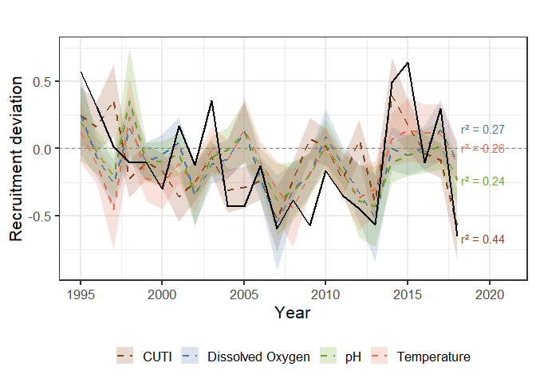<!-- -->

``` r
ggsave('Figures/fig6.png', width = 8, height = 4, dpi = 300)
```

    ## Warning: Removed 2 rows containing missing values or values outside the scale range
    ## (`geom_line()`).

#### Better at predicting negative vs. positive recruitment

``` r
sign_performance <- best_models %>%
  mutate(
    augmented = map(model, augment)
  ) %>%
  unnest(augmented) %>%
  mutate(
    observed_sign = if_else(dev > 0, "positive", "negative"),
    predicted_sign = if_else(.fitted > 0, "positive", "negative"),
    correct = observed_sign == predicted_sign
  )

accuracy_summary <- sign_performance %>%
  group_by(driver) %>%
  summarise(
    accuracy = mean(correct),
    n = n()
  )

loocv_classification <- function(model) {
  data <- model$model
  n <- nrow(data)
  
  preds <- map_dbl(1:n, function(i) {
    train <- data[-i, ]
    test <- data[i, ]
    
    m <- lm(dev ~ predictor, data = train)
    predict(m, newdata = test)
  })
  
  tibble(
    observed = data$dev,
    predicted = preds
  ) %>%
    mutate(
      observed_sign = if_else(observed > 0, "positive", "negative"),
      predicted_sign = if_else(predicted > 0, "positive", "negative"),
      correct = observed_sign == predicted_sign
    )
}

loocv_results <- best_models %>%
  mutate(
    results = map(model, loocv_classification)
  ) %>%
  unnest(results)

loocv_summary <- loocv_results %>%
  group_by(driver) %>%
  summarise(
    accuracy = mean(correct),
    TP = sum(predicted_sign == "positive" & observed_sign == "positive"),
    TN = sum(predicted_sign == "negative" & observed_sign == "negative"),
    FP = sum(predicted_sign == "positive" & observed_sign == "negative"),
    FN = sum(predicted_sign == "negative" & observed_sign == "positive"),
    sensitivity = TP / (TP + FN),
    specificity = TN / (TN + FP)
  )

loocv_summary
```

    ## # A tibble: 4 × 8
    ##   driver          accuracy    TP    TN    FP    FN sensitivity specificity
    ##   <chr>              <dbl> <int> <int> <int> <int>       <dbl>       <dbl>
    ## 1 CUTI_avg           0.75      5    13     3     3       0.625       0.812
    ## 2 DO_avg             0.625     3    12     4     5       0.375       0.75 
    ## 3 Temperature_avg    0.667     4    12     4     4       0.5         0.75 
    ## 4 pH_avg             0.583     2    12     4     6       0.25        0.75

``` r
classification_table <- loocv_results %>%
  group_by(driver) %>%
  summarise(
    n = n(),
    TP = sum(predicted_sign == "positive" & observed_sign == "positive"),
    TN = sum(predicted_sign == "negative" & observed_sign == "negative"),
    FP = sum(predicted_sign == "positive" & observed_sign == "negative"),
    FN = sum(predicted_sign == "negative" & observed_sign == "positive"),
    
    Accuracy = (TP + TN) / n,
    Sensitivity = TP / (TP + FN),   # detects positive years
    Specificity = TN / (TN + FP)    # detects negative years
  ) %>%
  mutate(
    Driver = dplyr::recode(driver,
      DO_avg = "Dissolved Oxygen",
      pH_avg = "pH",
      Temperature_avg = "Temperature"
    )
  ) %>%
  select(Driver, n, Accuracy, Sensitivity, Specificity, TP, TN, FP, FN)

classification_table
```

    ## # A tibble: 4 × 9
    ##   Driver              n Accuracy Sensitivity Specificity    TP    TN    FP    FN
    ##   <chr>           <int>    <dbl>       <dbl>       <dbl> <int> <int> <int> <int>
    ## 1 CUTI_avg           24    0.75        0.625       0.812     5    13     3     3
    ## 2 Dissolved Oxyg…    24    0.625       0.375       0.75      3    12     4     5
    ## 3 Temperature        24    0.667       0.5         0.75      4    12     4     4
    ## 4 pH                 24    0.583       0.25        0.75      2    12     4     6

``` r
final_table <- classification_table %>%
  mutate(
    Accuracy = round(Accuracy, 2),
    Sensitivity = round(Sensitivity, 2),
    Specificity = round(Specificity, 2)
  ) %>%
  select(Driver, Accuracy, Sensitivity, Specificity)

final_table
```

    ## # A tibble: 4 × 4
    ##   Driver           Accuracy Sensitivity Specificity
    ##   <chr>               <dbl>       <dbl>       <dbl>
    ## 1 CUTI_avg             0.75        0.62        0.81
    ## 2 Dissolved Oxygen     0.62        0.38        0.75
    ## 3 Temperature          0.67        0.5         0.75
    ## 4 pH                   0.58        0.25        0.75

``` r
knitr::kable(
  final_table
)
```

| Driver           | Accuracy | Sensitivity | Specificity |
|:-----------------|---------:|------------:|------------:|
| CUTI_avg         |     0.75 |        0.62 |        0.81 |
| Dissolved Oxygen |     0.62 |        0.38 |        0.75 |
| Temperature      |     0.67 |        0.50 |        0.75 |
| pH               |     0.58 |        0.25 |        0.75 |

#### Saving as a .rds for future projections

``` r
best_model_objects <- best_models %>%
  select(driver, Month, window, model)

saveRDS(best_model_objects, "best_historical_recruitment_models.rds")
```

## Future Oceanographic Characteristics

``` r
full_palette <- wes_palette("Moonrise2", type = "discrete")
full_palette
```

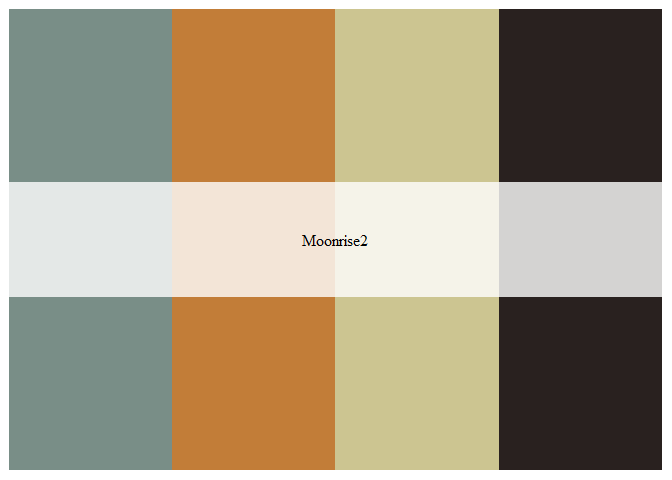<!-- -->

``` r
ESM_colors <- c("GFDL" = full_palette[1], 
                      "HADL" = full_palette[2],
                 "IPSL" = full_palette[4])
```

#### Reading in csv that were cleaned in python

``` r
GFDL<- read.csv("Data/GFDL_monthly_averages_allyear_2000_2100_ALL_41to34p4.csv") %>%
  mutate(ESM = "GFDL")

HADL <- read.csv("Data/HADL_monthly_averages_allyear_2000_2100_ALL_41to34p4.csv") %>%
  mutate(ESM = "HADL")

IPSL <- read.csv("Data/IPSL_monthly_averages_allyear_2000_2100_ALL_41to34p4.csv") %>%
  mutate(ESM = "IPSL")

# Combine all into one dataframe
future_ocean <- bind_rows(
  GFDL, HADL,IPSL
)

# View result
head(future_ocean)
```

    ##   Year Month   DO_avg     DO_sd   pH_avg      pH_sd Temperature_avg
    ## 1 2000   Jan 7.830906 0.7109679 8.001350 0.05543053        12.42688
    ## 2 2000   Feb 8.256494 0.5699230 8.024588 0.04323982        12.07983
    ## 3 2000   Mar 6.531714 0.7534450 7.892045 0.05770435        11.53167
    ## 4 2000   Apr 5.991125 0.7259535 7.838859 0.05004953        11.64637
    ## 5 2000   May 4.454567 0.6773171 7.721081 0.04826660        10.62630
    ## 6 2000   Jun 4.156804 0.8629587 7.682142 0.06980942        10.58630
    ##   Temperature_sd  Chla_avg    Chla_sd  ESM
    ## 1      0.7800164 0.2817904 0.08944624 GFDL
    ## 2      0.7340823 0.3137034 0.07648981 GFDL
    ## 3      0.9880996 0.3077663 0.14719978 GFDL
    ## 4      0.9979311 0.3333313 0.17437308 GFDL
    ## 5      1.0656167 0.2980853 0.26807229 GFDL
    ## 6      1.4407156 0.3938553 0.30887824 GFDL

#### Cleaning data for plotting

``` r
future_ocean2 <- future_ocean %>% 
  filter(Month %in% c("Jan", 'Feb', 'Mar', 'Apr', 'May', 'Jun', 'Jul', 'Aug'))
# annual means by ESM
future_annual <- future_ocean2 %>%
  group_by(ESM, Year) %>%
  summarize(
    DO = mean(DO_avg, na.rm = TRUE),
    pH = mean(pH_avg, na.rm = TRUE),
    Temperature = mean(Temperature_avg, na.rm = TRUE),
    .groups = "drop"
  )

# long format
future_long <- future_annual %>%
  pivot_longer(
    cols = c(DO, pH, Temperature),
    names_to = "Variable",
    values_to = "Value"
  )

# 1. Annual means by ESM
future_annual <- future_ocean %>%
  group_by(ESM, Year) %>%
  summarize(
    DO = mean(DO_avg, na.rm = TRUE),
    pH = mean(pH_avg, na.rm = TRUE),
    Temperature = mean(Temperature_avg, na.rm = TRUE),
    .groups = "drop"
  )

# 2. Common theme
fig_theme <- theme_classic(base_size = 14) +
  theme(
    legend.position = "bottom"
  )

# 3. DO plot
p_do <- ggplot(future_annual, aes(x = Year, y = DO, color = ESM)) +
  geom_line(linewidth = 1, alpha = .5) +
  geom_smooth(method = "lm", se = FALSE, linetype = "dashed", linewidth = 0.8) +
  labs(
    title = "",
    x = NULL,
    y = "DO (mg/L)"
  ) +
  scale_color_manual(values = ESM_colors, name = "Model") +
  fig_theme

# 4. pH plot
p_ph <- ggplot(future_annual, aes(x = Year, y = pH, color = ESM)) +
  geom_line(linewidth = 1, alpha = .5) +
  geom_smooth(method = "lm", se = FALSE, linetype = "dashed", linewidth = 0.8) +
  labs(
    title = "",
    x = NULL,
    y = "pH"
  ) +
  scale_color_manual(values = ESM_colors, name = "Model") +
  fig_theme

# 5. Temperature plot
p_temp <- ggplot(future_annual, aes(x = Year, y = Temperature, color = ESM)) +
  geom_line(linewidth = 1, alpha = .5) +
  geom_smooth(method = "lm", se = FALSE, linetype = "dashed", linewidth = 0.8) +
  labs(
    title = "",
    x = "Year",
    y = expression(Temperature~(degree*C))
  ) +
  scale_color_manual(values = ESM_colors, name = "Model") +
  fig_theme

# 6. Combine
final_plot <- p_do / p_ph / p_temp +
  plot_layout(guides = "collect") &
  theme(legend.position = "bottom")

final_plot
```

    ## `geom_smooth()` using formula = 'y ~ x'
    ## `geom_smooth()` using formula = 'y ~ x'
    ## `geom_smooth()` using formula = 'y ~ x'

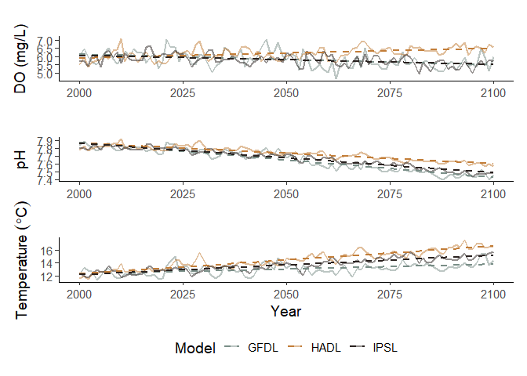<!-- -->

``` r
# define periods
historical <- future_ocean %>% filter(Year <= 2020)
future <- future_ocean %>% filter(Year >= 2020)

# summarize
summary_compare <- bind_rows(
  historical %>% mutate(Period = "Historical"),
  future %>% mutate(Period = "Future")
) %>%
  group_by(Period) %>%
  summarize(
    DO = mean(DO_avg, na.rm = TRUE),
    pH = mean(pH_avg, na.rm = TRUE),
    Temp = mean(Temperature_avg, na.rm = TRUE)
  )
```

#### Figure 8

``` r
# 1. Define periods
future_ocean2 <- future_ocean %>%
  mutate(
    Period = case_when(
      Year <= 2020 ~ "2000-2020",
      Year >= 2020 ~ "2020-2100",
      TRUE ~ NA_character_
    )
  ) %>%
  filter(!is.na(Period)) %>% 
  filter(Month %in% c("Jan", "Feb", "Mar", "Apr", "May", "Jun", "Jul", "Aug"))

# 2. Long format
future_long <- future_ocean2 %>%
  pivot_longer(
    cols = c(DO_avg, pH_avg, Temperature_avg),
    names_to = "Variable",
    values_to = "Value"
  ) %>%
  mutate(
    Variable = dplyr::recode(Variable,
      DO_avg = "DO",
      pH_avg = "pH",
      Temperature_avg = "Temperature"
    )
  )

# make sure order is correct
future_long$Period <- factor(future_long$Period, levels = c("2000-2020", "2020-2100"))
future_long$Variable <- factor(future_long$Variable, levels = c("DO", "pH", "Temperature"))

fig_theme <- theme_classic(base_size = 14) +
  theme(
    plot.title = element_text(hjust = 0.5),
    legend.position = "bottom",
    axis.text.x = element_text(angle = 45, hjust = 1)
  )

make_boxplot <- function(var_name, y_lab) {
  ggplot(
    dplyr::filter(future_long, Variable == var_name),
    aes(x = Period, y = Value, fill = ESM)
  ) +
    geom_boxplot(
      position = position_dodge(width = 0.75),
      outlier.shape = NA,
      alpha = 0.7
    ) +
    geom_point(
      aes(color = ESM),
      position = position_jitterdodge(
        jitter.width = 0.15,
        dodge.width = 0.75
      ),
      alpha = 0.2,
      size = 0.8
    ) +
    scale_color_manual(values = ESM_colors, name = "Model") +
    scale_fill_manual(values = ESM_colors, name = "Model") +
    theme(axis.text.x = element_text(angle = 90, vjust = 0.5, hjust = 1))+
    labs(
      title = "",
      x = NULL,
      y = y_lab
    ) +
    fig_theme
}

p_do_box <- make_boxplot("DO", "DO (mg/L)")
p_ph_box <- make_boxplot("pH", "pH")
p_temp_box <- make_boxplot("Temperature", expression(Temperature~(degree*C)))

final_boxplot <- (p_do_box | p_ph_box | p_temp_box) +
  plot_layout(guides = "collect") &
  theme(legend.position = "")

final_boxplot
```

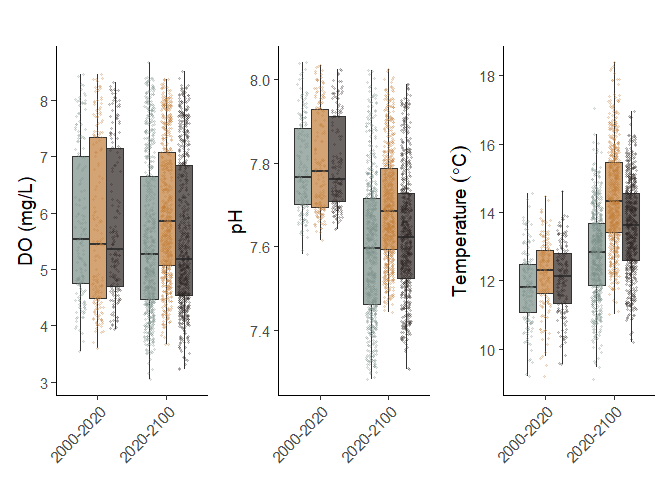<!-- -->

``` r
ggsave('Figures/fig8.png', width = 8, height = 4, dpi = 300)
```
